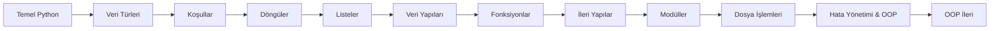

# 📅 Haftalık Ders İçeriği (BGT132)

Bu repository, **Yazılım Geliştirme Teknolojileri (BGT132)** dersi kapsamında haftalık ilerlemeye göre yapılandırılmıştır.

---

## 🗂️ Haftalık Konu Planı

### 📘 Hafta 1 – Python’a Giriş ve Temeller

* Python nedir?
* Python kurulumu
* Python syntax
* `print()` fonksiyonu
* Yorum satırları
* Değişkenler
* `type()` fonksiyonu

---

### 📘 Hafta 2 – Veri Türleri ve Casting

* `int`, `float`, `str`, `bool`, `None`
* Sayılar (Numbers)
* String işlemleri
* Type casting (`int()`, `float()`, `str()`)
* Kullanıcıdan veri alma (`input()`)

---

### 📘 Hafta 3 – Operatörler ve Koşullar

* Aritmetik operatörler
* Karşılaştırma operatörleri
* Mantıksal operatörler
* `if`, `elif`, `else`
* Girintileme (indentation) mantığı

---

### 📘 Hafta 4 – Döngüler

* `while` döngüsü
* `for` döngüsü
* `range()`
* `break`, `continue`, `pass`

---

### 📘 Hafta 5 – Listeler (Lists)

* Liste tanımlama
* Liste elemanlarına erişim
* Liste metotları
* Döngülerle liste kullanımı
* Basit algoritma örnekleri

---

### 📘 Hafta 6 – Tuple, Set ve Dictionary

* `tuple`
* `set`
* `dictionary`
* Veri yapıları arasındaki farklar
* Kullanım senaryoları

---

### 📘 Hafta 7 – Fonksiyonlar

* Fonksiyon tanımlama
* Parametreler ve `return`
* Varsayılan parametreler
* `*args`, `**kwargs`
* Scope (yerel / global değişkenler)

---

### 📘 Hafta 8 – String & Veri Yapıları ile İleri Seviye İşlemler

* String metotları
* List comprehension
* Dictionary loop’ları
* Nested yapılar

---

### 📘 Hafta 9 – Modüller ve Paketler

* `import` kullanımı
* Built-in modüller
* `math`, `random`, `datetime`
* Kendi modülünü yazma

---

### 📘 Hafta 10 – Dosya İşlemleri

* Dosya açma / kapama
* Dosyaya yazma
* Dosyadan okuma
* `with` kullanımı
* Hata ihtimalleri

---

### 📘 Hafta 11 – Hata Yönetimi ve OOP

* `try / except`
* Exception türleri
* Class ve Object
* `__init__`
* Methodlar

---

### 📘 Hafta 12 – OOP Devam

* Inheritance (Kalıtım)
* Encapsulation

---

# 🔄 Haftalık Öğrenme Akışı

---

# 🎯 Dersin Genel Kazanımları

Bu ders sonunda öğrenciler:

* ✔️ Python programlama temellerini öğrenir
* ✔️ Algoritma geliştirme becerisi kazanır
* ✔️ Veri yapıları ve kontrol mekanizmalarını kullanabilir
* ✔️ Modüler ve okunabilir kod yazabilir
* ✔️ Nesne yönelimli programlama (OOP) mantığını kavrar
* ✔️ Gerçek dünya problemlerine çözüm geliştirebilir

